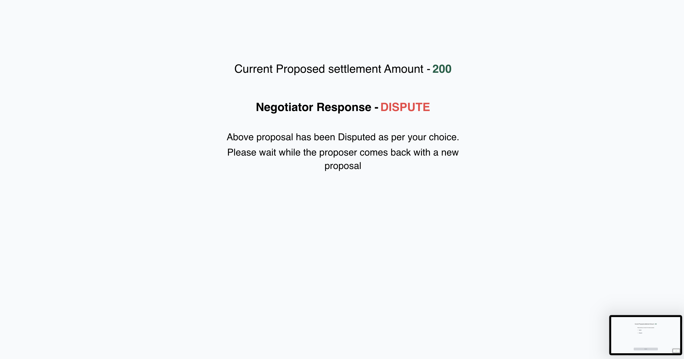
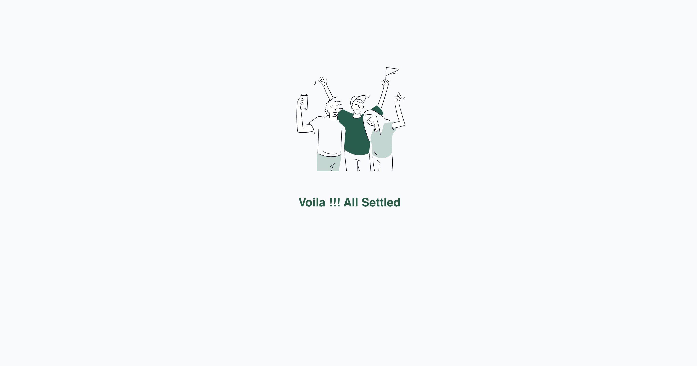

## Installation

1. Clone the repository:

```bash
git clone https://github.com/Iff812/Settlement-negotiation.git
```
2. Install the necessary dependencies:
```bash
npm install
```
3. Start the server
```bash
npm start
```
Access the application via http://localhost:3000.


Now Setup Backend

1. Install the necessary dependencies:
```bash
cd Backend
npm install
```
2. Start the server
```bash
node index.js
```
Access the application via http://localhost:3003.


# Configuration
-*Prerequisites*-
1. Install Mongodb Compass
Reference - https://www.mongodb.com/docs/compass/current/install/

2. Set Replica Set for Mongodb Compass [Mandatory for live updates]
[Replica Set Readme](REPLICASET.md)

#

## Technologies Used
`NodeJS`,
`ExpressJS`,
`MongoDB`,
`ReactJS`,
`Tailwind`,


## Screenshots for reference

### Party Selection


### No Settelement proposed


### Proposer to add a proposal


### Proposer to Edit a proposal


### Settlement disputed for Proposer


### Settlement settled for Proposer


### Negotiator to respond


### Negotiator after response submitted


### Negotiator after settlement

